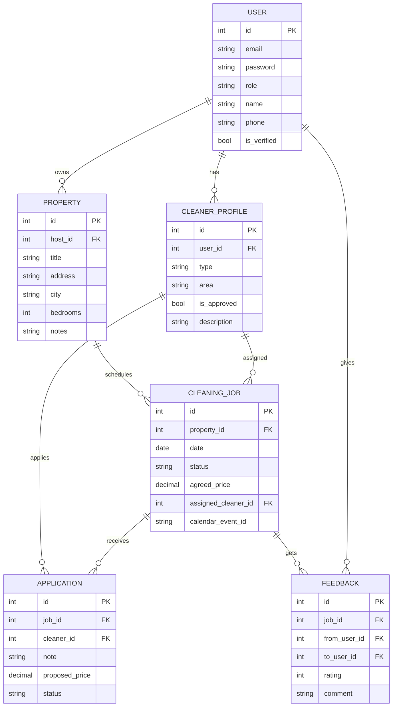

# Database Schema and Application Workflow

## Database Schema (ER Diagram)

## Application Workflow

1. **User Registration & Roles**
   - Users sign up as Host, Cleaner, or Admin.
   - Cleaners must be verified by Admin before applying for jobs.
2. **Property Management (Host)**
   - Hosts add/manage properties.
3. **Job Posting (Host)**
   - Hosts post single or batch cleaning jobs for their properties.
4. **Cleaner Applications**
   - Verified cleaners see available jobs and apply with notes and price.
5. **Assignment**
   - Hosts review applications and assign a cleaner.
6. **Job Execution**
   - Job status updates as scheduled, in progress, completed.
7. **Calendar Sync**
   - Internal calendar is the source of truth; Google/iCal sync available.
8. **Notifications**
   - Email, in-app, and SMS notifications for key events.
9. **Feedback**
   - After job completion, both host and cleaner leave reviews.
10. **Admin Moderation**
    - Admins approve cleaners, moderate reviews, and resolve disputes.
