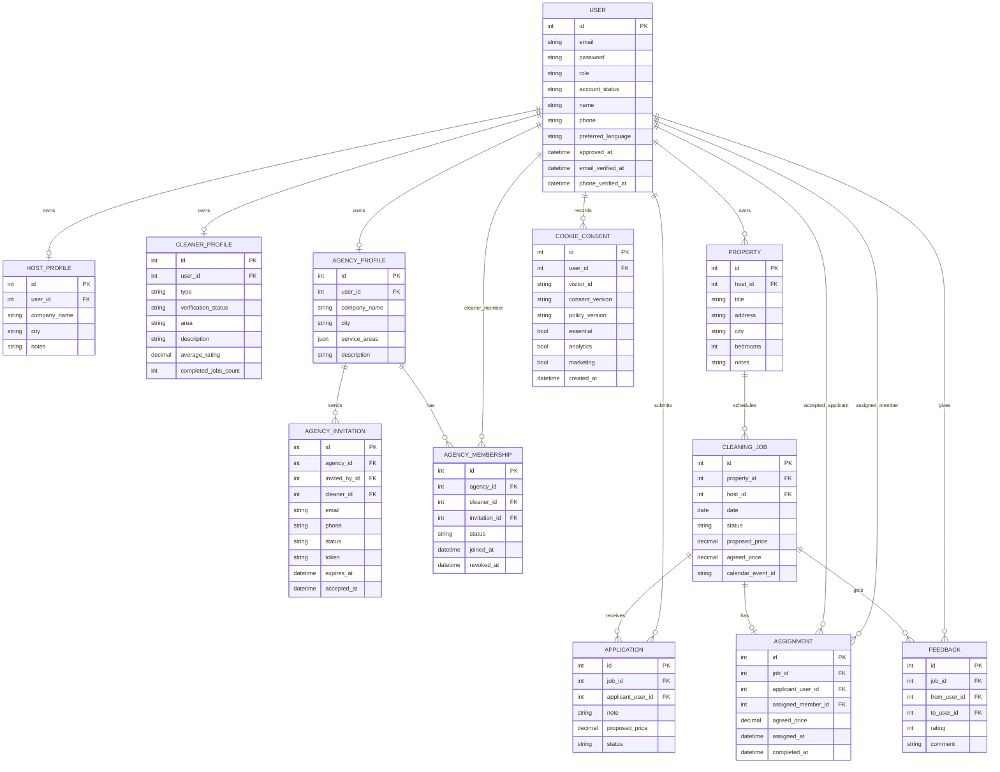

# Database Schema and Application Workflow

## Restart Handoff

Deployment work is paused for a required Windows restart so Docker Desktop can run. See `CURRENT_PROGRESS.md` for resume steps.

## Database Schema (ER Diagram)

## Application Workflow

1. **User Registration & Approval**
   - Users sign up as Property Owner (`host`), Cleaner, Agency, or Admin.
   - New public signups start as `pending`.
   - Pending users can log in and complete onboarding, but cannot post jobs, apply, accept assignments, or assign agency work.
   - Admins approve, reject, or suspend users.
2. **Future Email/SMS Verification**
   - User records store future email and phone verification timestamps.
   - Code delivery and expiry through email or SMS are planned for a later provider integration.
3. **Property Management (Property Owner)**
   - Approved property owners add/manage properties.
4. **Job Posting**
   - Approved property owners post single or batch cleaning jobs for their properties.
5. **Cleaner and Agency Applications**
   - Approved, verified cleaners can apply directly.
   - Approved agencies can apply as an agency account.
6. **Assignment**
   - Hosts review applications and assign one cleaner or agency.
   - If an agency is assigned, it chooses an active member cleaner for the job calendar.
7. **Agency Membership**
   - Agencies invite cleaners by email or phone.
   - Cleaners accept invitations from their own user account.
   - Agency work can be assigned only to active member cleaners with approved and verified accounts.
8. **Job Execution**
   - Job status updates as scheduled, assigned, completed, cancelled, or disputed.
9. **Calendar Sync**
   - Internal calendar is the source of truth; Google/iCal sync remains available through the calendar domain.
10. **Notifications**
    - Email, in-app, and SMS notifications remain the intended channels for key events.
11. **Feedback**
    - After job completion, involved parties leave two-way reviews.
12. **Cookie Consent**
    - Essential login/security cookies are always enabled.
    - Analytics and marketing cookies are recorded only after explicit consent.
    - Consent stores visitor/user identity, choices, consent version, policy version, and timestamp.
13. **Admin Moderation**
    - Admins approve accounts, verify cleaners/agencies, moderate reviews, inspect agency memberships, and resolve disputes.
