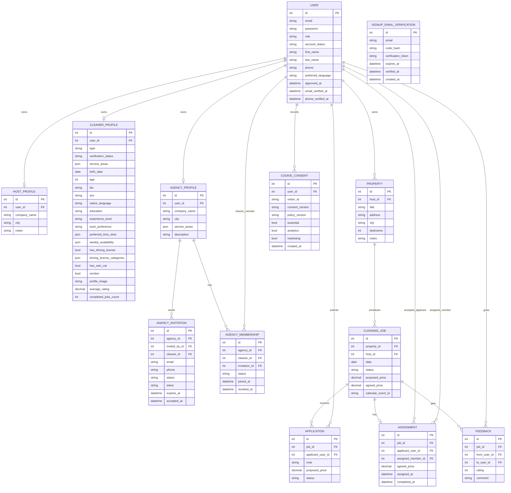

# Database Schema and Application Workflow

## Restart Handoff

See `CURRENT_PROGRESS.md` for the current deployment and signup-flow resume point.

## Database Schema (ER Diagram)

## Application Workflow

1. **User Registration & Approval**
   - Users sign up as Property Owner (`host`), Cleaner, Agency, or Admin.
   - New public signups start as `pending`.
   - Signup first sends a 6-digit confirmation code to the new user's inbox through Resend only.
   - The server stores only the hashed code and returns an `email_verification_token` after successful verification.
   - Final account creation requires the verified token and sets `email_verified_at`.
   - Pending users can log in and complete onboarding, but cannot post jobs, apply, accept assignments, or assign agency work.
   - Admins approve, reject, or suspend users.
2. **Email/SMS Verification**
   - Email confirmation is implemented through a 6-digit Resend code before account creation.
   - Phone/SMS verification remains planned for a later provider integration.
3. **Single-Route Signup Wizard**
   - Normal signup happens at `/signup` as a React wizard.
   - Credentials and email-code confirmation happen before progress tracking.
   - Progress starts at `Choose account type`.
   - Continue and Back update React state and use Motion animations instead of loading a new page.
   - Old signup step URLs redirect to `/signup`.
4. **Cleaner Personal Information And Preferences**
   - Cleaner signup includes a compact dropdown birth-date calendar with 18+ validation.
   - Required cleaner fields: birth date, sex, native language, experience level, work preference, and at least one preferred time slot.
   - Optional cleaner fields: weekly availability, education, smoker status, own-car status, and driving-license details/categories unless made required by later verification policy.
   - Current cleaner flow: choose account type → personal information → location/service areas → native language → experience → availability → create account.
   - Current host/agency flow: choose account type → location/service areas → create account.
   - If future signup questions are added for Cleaner, Host, or Agency, matching database fields, migrations, serializer validation, profile serialization, admin visibility, and signup tests must be added with the frontend change.
5. **Property Management (Property Owner)**
   - Approved property owners add/manage properties.
6. **Job Posting**
   - Approved property owners post single or batch cleaning jobs for their properties.
7. **Cleaner and Agency Applications**
   - Approved, verified cleaners can apply directly.
   - Approved agencies can apply as an agency account.
8. **Assignment**
   - Hosts review applications and assign one cleaner or agency.
   - If an agency is assigned, it chooses an active member cleaner for the job calendar.
9. **Agency Membership**
   - Agencies invite cleaners by email or phone.
   - Cleaners accept invitations from their own user account.
   - Agency work can be assigned only to active member cleaners with approved and verified accounts.
10. **Job Execution**
   - Job status updates as scheduled, assigned, completed, cancelled, or disputed.
11. **Calendar Sync**
   - Internal calendar is the source of truth; Google/iCal sync remains available through the calendar domain.
12. **Notifications**
   - Email, in-app, and SMS notifications remain the intended channels for key events.
13. **Feedback**
   - After job completion, involved parties leave two-way reviews.
14. **Cookie Consent**
   - Essential login/security cookies are always enabled.
   - Analytics and marketing cookies are recorded only after explicit consent.
   - Consent stores visitor/user identity, choices, consent version, policy version, and timestamp.
15. **Admin Moderation**
   - Admins approve accounts, verify cleaners/agencies, moderate reviews, inspect agency memberships, and resolve disputes.
